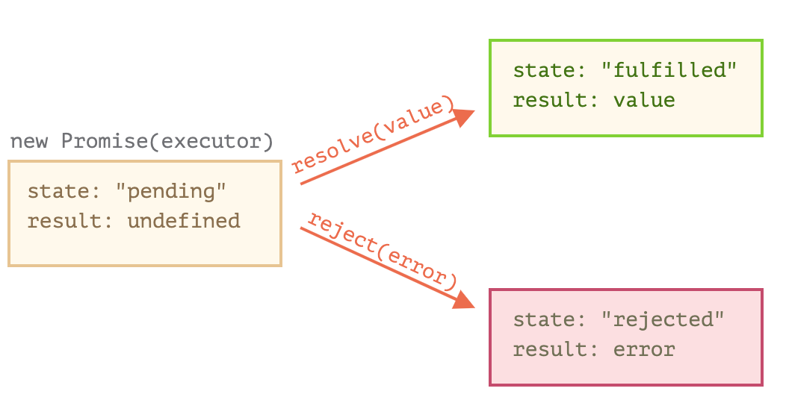

# [Promises, async/await](https://javascript.info/async)

## 11.1) [Introduction: callbacks](https://javascript.info/callbacks)

자바스크립트 호스트 환경(자바스크립트가 구동되는 환경 - ex. 웹 브라우저, node.js)이 제공하는 여러 함수를 사용하면 **비동기 동작을 스케줄링** 할 수 있다.

### 비동기 동작이란?

[출처: [Async, 비동기와 동기] Promise에서 Await까지]([https://velog.io/@rohkorea86/Promiseis-%EB%B9%84%EB%8F%99%EA%B8%B0%EB%8F%99%EA%B8%B0%EC%97%90%EC%84%9C-Promise%EA%B9%8C%EC%A7%80](https://velog.io/@rohkorea86/Promiseis-비동기동기에서-Promise까지))

동기와 비동기의 구분은, 요청받고 응답받는 시간대의 차이이다.

동기(synchronous)는 요청을 하는 시기와 응답을 받는 시기가 일치한다. 응답까지의 대기시간이 필요하면, 어플리케이션은 해당 응답을 받을 때 까지 멈추게 된다.

비동기(asynchronous)는 요청과 응답이 다른 시간대에 존재한다. 요청에 대해 바로 응답받지 않아도 되며, 요청한 후 프로그램은 응답 받기 위해 대기하지 않고 계속해서 진행하다가, 언젠가 응답을 받으면 다음 로직을 수행한다.

### 비동기 동작 예시

스크립트 태그를 동적으로 만들고, 이를 문서에 추가하는 함수를 만들어보자.

```js
function loadScript(src) {
  let script = document.createElement('script');
  script.src = src;
  document.head.append(script);
}
```

위 함수는 아래와 같이 사용할 수 있다.

```js
// 해당 경로에 위치한 스크립트를 불러오고 실행
loadScript('/my/script.js');
```

그런데 이때, loadScript 로 동적으로 추가한 script.js는 비동기적으로 실행된다. 즉, loadScript 함수가 호출되어 script.js를 로딩하더라도, 이후의 코드들은 script.js가 로딩 될때까지 기다리지 않고 쭉 실행된다.

script.js가 끝나자마자 이 스크립트를 사용해 어떤 작업을 해야한다고 가정할 때, 아래처럼 바로 script.js 내부의 함수를 호출하면 원하는 대로 작동하지 않는다. 아직 브라우저가 스크립트를 읽어오지 않았기 때문이다.

```js
loadScript('/my/script.js'); // script.js에 "function newFunction() {…}"이 있다고 가정했을 때
newFunction(); // 함수가 존재하지 않는다는 에러가 발생한다.
```

우리가 원하는 작업을 수행하려면, **콜백 함수**에 넣어주어 로딩이 끝난 뒤에 나중에 호출되도록 해야 한다. 콜백함수로는 대개 익명함수를 전달한다.

```js
function loadScript(src, callback) {
  let script = document.createElement('script');
  script.src = src;
  // 콜백함수는 스크립트가 로드된 후에 실행된다.
  script.onload = () => callback(script);
  document.head.append(script);
}

loadScript('https://cdnjs.cloudflare.com/ajax/libs/lodash.js/3.2.0/lodash.js', script => {
  alert(`${script.src}가 로드되었습니다.`);
  alert( _ ); // 스크립트에 정의된 함수
});
```

위와 같은 방식을 콜백 기반 비동기 프로그래밍이라고 한다.

### 에러 핸들링

콜백 기반 비동기 프로그래밍에서 에러를 핸들링하기 위해서는 주로 오류 우선 콜백(error-first callback) 의 패턴을 따른다.

```js
function loadScript(src, callback) {
  let script = document.createElement('script');
  script.src = src;

  script.onload = () => callback(null, script);
  script.onerror = () => callback(new Error(`${src}를 불러오는 도중에 에러가 발생했습니다.`));

  document.head.append(script);
}

loadScript('/my/script.js', function(error, script) {
  if (error) {
    // 에러 처리
  } else {
    // 스크립트 로딩이 성공했을 때
  }
});
```

- 1. callback의 첫번째 인수는 에러를 위해 남겨둔다. 에러가 발생하면 이 인수를 이용해 callback(error)이 호출된다.
- 2. 두번째 (혹은 그 이상) 인수는 동작이 성공했을 경우를 위해 남겨둔다.


이러한 콜백 기반 비동기 프로그래밍은 비동기 동작이 많아질 수록 중첩 호출로 인해 콜백 헬을 만들어내며,  가독성을 해치고 유지보수를 힘들게 한다.

이를 해결하는 방법은 다음 챕터에 알아볼 Promise이다.


## 11.2) [Promise](https://javascript.info/promise-basics)

### Promise란?

**제작 코드** : 원격에서 스크립트를 불러오는 것 같이, 시간이 걸리는 코드이다.

**소비 코드** : 제작 코드의 결과를 기다렸다가 이를 소비하는 코드. 제작 코드를 소비하는 주체는 여럿이 될 수 있다.

**Promise** : 제작코드와 소비 코드를 연결해 주는 특별한 **자바스크립트 객체**이다. Promise는 시간이 얼마나 걸리든, 제작 코드의 결과가 준비되었을 때 모든 소비 코드가 결과를 사용할 수 있도록 해준다.

#### Promise의 문법

```js
let promise = new Promise(function(resolve, reject) {
  // 제작 코드 : executor
});
```

`new Promise` 에 전달되는 함수 (executor) 은 `new Promise`가 만들어질 때 자동으로 실행된다.

executor의 인수 `resolve`와 `reject` 는 자바스크립트가 자체적으로 제공하는 콜백으로, 개발자는 이는 신경쓰지 않고 executor 함수만 작성하면 된다.

대신 executor에서는 인수로 넘겨준 콜백 중 하나를 반드시 호출해야 한다.

- resolve(value) - 일이 성공적으로 끝난 경우, 그 결과를 나타내는 value와 함께 호출
- reject(error) - 에러 발생 시 에러 객체를 나타내는 error과 함께 호출

executor은 new Promise 시 자동으로 실행되는데, 이 executor 안에서 (시간이 걸리는) 일이 처리된다. 처리가 끝나면 executor은 일 처리의 결과게 따라 `resolve` 혹은 `reject` 를 호출한다.

#### Promise의 프로퍼티

`new Promise` 생성자가 반환하는 **promise** 객체는 다음과 같은 내부 프로퍼티를 갖는다.

- state : 처음엔 pending 이었다가, resolve가 호출되면 furfilled, reject가 호출되면 rejected로 변한다.
- result : 처음엔 undefined 었다가, resolve(value)가 호출되면 value로, reject(error)가 호출되면 error로 변한다.

정리하자면, executor은 아래처럼 promise의 상태를 둘 중 하나로 변화시킨다.


#### Promise 예시

```js
let promise = new Promise(function(resolve, reject) {
  // Promise 생성자 함수가 실행되면 (promise 객체가 만들어지면) executor 함수는 자동으로 실행됨.
  // 1초 뒤에 일이 성공적으로 끝났다는 신호가 전달되면서 result가 'done'이 됨.
  setTimeout(() => resolve("done"), 1000);
});
```

1) executor 함수는 new Promise에 의해 즉각적으로 호출된다.

2) executor 함수는 인자로 resolve와 reject를 받고, 이 함수들은 자바스크립트 엔진이 미리 정의한 함수이므로 개발자가 따로 만들 필요가 없다. 다만, **resolve나 reject 중 하나는 반드시 호출**해야 한다.

3) 위 예제에서, executor이 실행된 지 1초 후 resolve(done) 이 호출되고, promise 객체의 상태가 변화한다. (state: fulfilled, result: done)


## 11.3) [Promises chaining](https://javascript.info/promise-chaining)


## 11.4) [Error handling with promises](https://javascript.info/promise-error-handling)


## 11.5) [Promise API](https://javascript.info/promise-api)


## 11.6) [Promisification](https://javascript.info/promisify)


## 11.7) [Microtasks](https://javascript.info/microtask-queue)


## 11.8) [Async/await](https://javascript.info/async-await)

