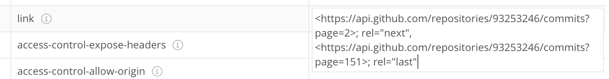

# [Generators, advanced iteration](https://javascript.info/generators-iterators)

## 12.1) [Generators](https://javascript.info/generators)

일반적인 함수는 하나 또는 0개의 값만을 반환하지만, 제너레이터를 사용하면 **여러 개의 값을 필요에 따라 하나씩 반환**(yield)할 수 있다.

### 제너레이터 함수

제너레이터를 만들기 위해선 제너레이터 함수라 불리는 특별한 문법 구조 `function*`이 필요하다.

```js
function* generateSequence() {
  yield 1;
  yield 2;
  return 3;
}

let generator = generateSequence();
console.log(generator) // [object Generator]
```

제너레이터 함수는 일반 함수와 다르게 동작한다. 제너레이터 함수를 호출하면 코드가 실행되는 것이 아니라, 실행을 처리하는 특별 객체인 **제너레이터 객체**가 반환된다.

`next()` 는 제너레이터의 주요 메서드로, `next()` 를 호출하면 가장 가까운 `yield <value>` 문을 만날 때까지 실행이 지속된다.  `yield <value>` 문을 만나면 실행을 멈추고 value가 바깥 코드에 반환된다. 

`next()` 는 항상 아래 두 프로퍼티를 가진 **객체를 반환**한다.

- value: 산출 값
- done: 함수 코드 실행이 끝났으면 true, 아니면 false

실행이 return 문에 다다르면 위 예제의 경우  `{value:3, done:true}`  를 리턴하고, 계속해서 generator.next() 를 호출해도 `{done: true}` 가 반환될 뿐 아무 소용이 없다.

### 제너레이터와 이터러블

제너레이터는 **이터러블**이다. 따라서 아래와 같은 작업이 가능하다.

1)  `for...of` 반복문을 통해 값을 얻을 수 있다. 단, for of 는 done:true일때 마지막 value를 무시하므로 모든 값이 출력되길 원하면 yield로 값을 반환해야 한다.

```js
function* generateSequence() {
  yield 1;
  yield 2;
  yield 3;
}

let generator = generateSequence();

for(let value of generator) {
  alert(value); // 1, 2, 3
}
```

2) spread 문법을 사용할 수 있다.

```js
let sequence = [0, ...generateSequence()];
console.log(sequence); // 0,1,2,3
```

### 이터러블 대신 제너레이터 사용하기

From에서 to까지의 값을 출력하는 range 함수를 이터러블로 구현하면 아래와 같다.

```js
let range = {
  from: 1,
  to: 5,
  // for..of 최초 호출 시 Symbol.iterator가 호출된다
  [Symbol.iterator](){
    return {
      current: this.from,
      last: this.to,
     	next() {
        if (this.current <= this.last) {
          return {done:false, value:this.current++};
        } else {
          return {done:true}
        }
      }
    }
  }
}
```

제너레이터 함수를 사용하면 위의 range 기능을 좀 더 간결하게 작성할 수 있다.

```js
let range = {
  from: 1,
  to: 5,
  *[Symbol.iterator]() {
    for(let value = this.from; value <= this.to; value++){
      yield value;
    }
  }
}
```

range[Symbol.iterator] 이 제너레이터 객체를 반환하고, 제너레이터 객체는 For...of 가 동작하기 위해 필요한 2가지 조건 (`.next()` 메서드가 있을 것, 반환 값의 형태가 `{value: ..., done: true/false}` 일 것) 을 만족하기 때문에 잘 동작한다.

이처럼 제너레이터는 이터레이터를 쉽게 구현하기 위해 JS에 추가된 문법.

### 제너레이터 컴포지션

제너레이터 컴포지션은 제너레이터 안에 제너레이터를 임베딩 할 수 있는 특수한 기능이다.

연속된 숫자를 생성하는 제너레이터 함수는 아래와 같이 구현할 수 있다.

```js
function* generateSequence(start, end){
  for (let i = start; i <= end; i++) {
    yield i;
  }
}
```

`yield*` 를 사용하면 제너레이터를 다른 제너레이터에 끼워 넣을 수 있다. 이 문법을 이용해 아래와 같이 좀 더 복잡한 연속값을 생성할 수 있다.

```js
function* generateSequence(start, end) {
  for (let i = start; i <= end; i++) yield i;
}

function* generatePasswordCodes() {

  // 0..9
  yield* generateSequence(48, 57);

  // A..Z
  yield* generateSequence(65, 90);

  // a..z
  yield* generateSequence(97, 122);

}

let str = '';

for(let code of generatePasswordCodes()) {
  str += String.fromCharCode(code);
}

console.log(str) // 0123456789ABCDEFGHIJKLMNOPQRSTUVWXYZabcdefghijklmnopqrstuvwxyz
```

이렇게 제너레이터 컴포지션을 사용하면 한 제너레이터의 흐름을 자연스럽게 다른 제너레이터에 삽입할 수 있다.

### yield를 사용해 제너레이터 안·밖으로 정보 교환하기

제너레이터의 yield는 양방향 길과 같은 역할을 한다. 결과를 밖으로 전달할 뿐만 아니라, 값을 제너레이터 안으로 전달하기도 하기 때문이다.

일반 함수와 다르게, 제너레이터와 제너레이터를 호출하는 외부 코드는 `next/yield` 를 통해 정보를 교환할 수 있다.

```js
function* gen() {
    let ask1 = yield "2+2 = ?";
    console.log(ask1, "!");
    let ask2 = yield "3+3 = ?";
    console.log(ask2, "!");
}

let generator = gen();

console.log(generator.next().value);
console.log(generator.next(4).value);
console.log(generator.next(9).value);
```

첫번째 `.next()` 를 제외한 각 `next(value)` 는 현재 yield의 결과가 될 값을 제너레이터 안에 전달하고, 다음 yield의 결과로 되돌아온다.

### generator.throw

외부 코드는 `yield`의 결과가 될 값을 제너레이터 안에 전달하기도 하는데, 외부 코드가 에러를 던질 경우 에러가 yield에 전달된다. 에러를 yield에 전달하기 위해서는 `generator.throw(err)` 를 호출해야 한다.

```js
function* gen() {
  try {
    let result = yield "2 + 2 = ?";
    console.log("위에서 에러가 던져졌기 때문에 실행 흐름은 여기까지 다다르지 못합니다.");
  } catch(e) {
    alert(e);
  }
}

let generator = gen();
let question = generator.next().value;
generator.throw(new Error("데이터베이스에서 답을 찾지 못했습니다."));
```

yield에 던져진 에러는 try catch에서 잡힌다.

혹은 아래처럼 외부 코드에서 잡아도 된다. 여기서도 잡지 못하면 스크립트가 죽게 된다.

```js
try {
  generator.throw(new Error("데이터베이스에서 답을 찾지 못했습니다."));
} catch(e) {
  alert(e);
}
```

### 정리

모던 자바스크립트에서는 제너레이터를 잘 사용하지 않지만, 제너레이터를 사용하면 실행 중에도 제너레이커 호출 코드와 데이터를 교환할 수 있기 때문에 유용하다. 또한, 이터러블 객체를 쉽게 만들 수 있다는 장점도 있다.

비동기 제너레이터는 페이지네이션을 통해 전송되는 비동기 데이터 스트림을 다룰 때 유용한데, 이는 다음 챕터에서 알아볼 것임.


## 12.2) [Async iterators and generators](https://javascript.info/async-iterators-generators)

비동기 이터레이터/제너레이터를 사용하면 비동기적으로 들어오는 데이터를 필요에 따라 처리할 수 있다.

### async 이터레이터

일반 이터레이터는 객체이다. 일반 이터레이터를 비동기 이터레이터로 만들기 위해서는 아래와 같은 작업이 필요하다.

1. Symbol.iterator 대신 **Symbol.asyncIterator** 을 사용해야 한다.
2. next() 는 Promise 를 반환해야 한다.
3. 비동기 이터러블 객체를 대상으로 하는 반복 작업은 `for await (let item of iterable)` 반복문을 사용해야 한다.

1초마다 비동기적으로 값을 반환하는 range 이터러블 객체를 만들어보자.

```js
let range = {
    from: 1,
    to: 5,
  	// Symbol.iterator 대신 Symbol.asyncIterator
    [Symbol.asyncIterator]() {
        return {
            current: this.from,
            last: this.to,
          	// async에 의해 자동으로 객체는 Promise로 감싸진다
            async next() {
                await new Promise((resolve) => setTimeout(resolve, 1000));
                if (this.current <= this.last) {
                    return { done: false, value: this.current++ };
                } else {
                    return { done: true };
                }
            },
        };
    },
};

(async () => {
  	// for await 사용
    for await (let value of range) {
        console.log(value);
    }
})();
```

### async 제너레이터

일반 제너레이터는 동기적 문법이지만, async/await를 사용하면 가능하다.

```js
// 제너레이터 앞에 async를 붙인다
async function* generateSequence(start, end){
  for (let i = start; i <= end; i++){
    // 이제 next()는 비동기적(1초 지연)으로 작동하고, promise를 반환한다.
    await new Promise(resolve => setTimeout(resolve, 1000));
    yield i;
  }
}

(async () => {
  let generator = generateSequence(1,5);
  for await (let value of generator) {
    console.log(value); // 1,2,3,4,5
  }
})
```

`generator.next()` 를 사용해서 값을 얻을 때도, next가 promise를 반환하기 때문에 아래와 같이 `await` 를 붙여줘야 한다.

```js
result = await generator.next();
```

### async 이터러블

반복 가능한 객체를 만들기 위해서는 아래와 같이 객체에 `Symbol.iterator` 을 추가해야 한다. 

```js
let range = {
  from: 1,
  to: 5,
  [Symbol.iterator]() {
    return // range를 반복가능하게 만드는 next 메서드가 구현된 객체
  }
}
```

그런데  `Symbol.iterator`는 위 처럼 `next`가 구현된 일반 객체를 반환하는 것보다는, **제너레이터를 반환하도록 구현**하는 경우가 더 많다.

```js
let range = {
  from: 1,
  to: 5,
  *[Symbol.iterator]() {
    for(let value = this.from; value <= this.to; value++){
      yield value;
    }
  }
}

for(let value of range) {
  console.log(value)
}
```

위 상태에서 제너레이터를 비동기적으로 동작하게 하려면, `Symbol.iterator`를 async `Symbol.asyncIterator`로 바꾸고, 호출할 때 async 함수로 감싼 for await (let ... of) 를 사용하면 된다.

```js
let range = {
  from: 1,
  to: 5,

  async *[Symbol.asyncIterator]() {
    for(let value = this.from; value <= this.to; value++) {
      await new Promise(resolve => setTimeout(resolve, 1000));
      yield value;
    }
  }
};

(async () => {
  for await (let value of range) {
    alert(value); // 1, 2, 3, 4, 5
  }
})();
```

### 실제 사용 사례

실무에서 사용할 법한 use case를 알아보자.

많은 온라인 서비스가 페이지네이션을 구현해 데이터를 전송한다. 예를 들어, 클라이언트가 github 커밋 이력을 조회하기 위해 요청을 보내면, 서버는 일정 숫자(예를 들어 30개)의 정보를 담은 JSON과 함께, 다음 페이지에 대한 정보를 Link 헤더에 담아 응답한다. 클라이언트는 이후 더 많은 정보가 필요하면 헤더에 담긴 링크를 이용해 다음 정보를 보내도, 원하는 정보를 얻을 때 까지 이런 과정을 반복한다.

async iterable 객체를 이용해 이와 유사하게 작동하는 API를 만들어 볼 수 있다.

```js
let repo = "javascript-tutorial/en.javascript.info"; // 커밋 정보를 얻어올 GitHub 레포

async function* fetchCommits(repo) {
    let url = `https://api.github.com/repos/${repo}/commits`;
    while (url) {
        const response = await fetch(url, {
            headers: { "User-Agent": "Our script" }, // Github은 모든 요청에 user-agent 헤더를 강제함
        });
        const body = await response.json(); // 응답은 json 형태로 옴
        console.log(response.headers);
        let nextPage = response.headers
            .get("Link")
            .match(/<(.*?)>; rel="next"/);
        nextPage = nextPage?.[1];
        url = nextPage;
        for (let commit of body) {
            yield commit;
        }
    }
}

(async () => {
    let count = 0;
    for await (const commit of fetchCommits(repo)) {
        console.log(commit.author.login);
        if (++count == 100) {
            break;
        }
    }
})();
```

참고로 Postman으로 response header을 보면 Link 헤더가 이런식으로 다음 페이지의 URL을 주는 것을 볼 수 있다.



### 정리

데이터가 비동기적으로 들어오는 경우, 비동기 이터레이터/제너레이터를 사용한다.

용량이 큰 파일을 다운로드하거나 업로드 할 때처럼 띄엄띄엄 들어오는 데이터 스트림을 다룰 때 async 제너레이터를 사용할 수 있다.