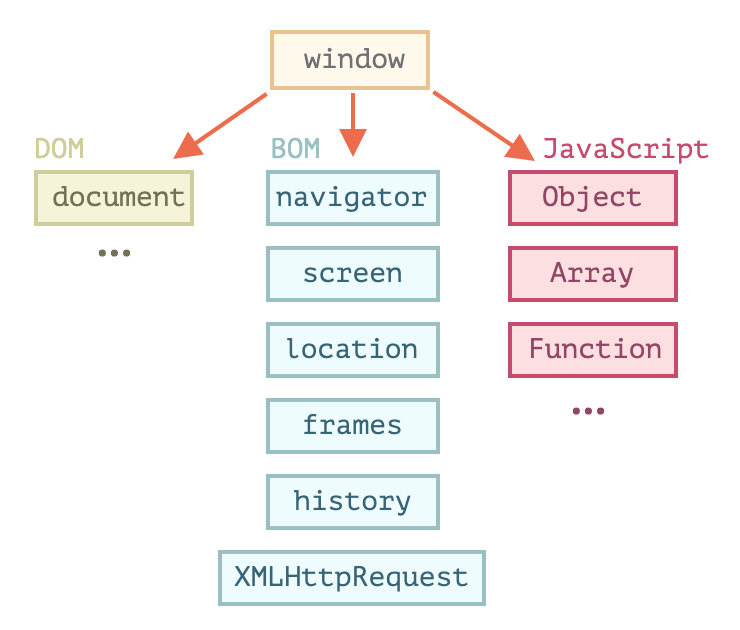

# [Document(1)](https://javascript.info/document)

## 1.1) [Browser environment, specs](https://javascript.info/browser-environment)

자바스크립트는 본래 웹 브라우저에서 사용하려고 만든 언어이지만, 지금은 다양한 플랫폼 (호스트) 을 지원하는 언어로 변모함.

호스트 환경마다 해당 플랫폼에 특정되는 기능을 제공한다. Ex. 웹브라우저 - 웹 페이지를 제어하기 위한 수단, Node.js - 서버 사이드 기능

### 호스트 환경이 웹 브라우저일 때 사용할 수 있는 기능

출처: https://ko.javascript.info/browser-environment



#### window

최상단에 위치한 루트 객체이다. 아래의 역할을 한다.

1. JS 코드의 전역 객체 - 스크립트의 전역 함수는 곧 전역 객체 window의 메서드

```js
function sayHi() {
  alert("안녕하세요.");
}

// 전역 함수 = window 의 메서드
window.sayHi();
```

2. 브라우저 창을 대변하고, 이를 제어할 수 있는 메서드를 제공

```js
alert(window.innerHeight); // 창 내부(inner window) 높이
```

#### DOM (문서 객체 모델, Document Object Model)

DOM은 웹 페이지 내의 모든 콘텐츠를 객체로 나타내주며, 이 객체는 수정 가능함.

`document` 객체는 페이지의 기본 진입점 역할을 하고, `document` 객체를 이용해 페이지 내 무엇이든 변경할 수 있고 원하는 것을 만들 수도 있음.

```js
// 배경색 변경
document.body.style.background = "purple";

// 1초 후 원상태로 복구
setTimeout(() => document.body.style.background = "", 1000);
```

DOM은 수많은 기능을 제공하는데, 관련 프로퍼티와 메서드에 대한 정보는 관련 명세서에서 찾을 수 있음. (WHATWG의 DOM Living Standard – [https://dom.spec.whatwg.org](https://dom.spec.whatwg.org/))

#### BOM (브라우저 객체 모델, Browser Object Model)

BOM은 문서 이외의 모든 것을 제어하기 위해 브라우저가 제공하는 추가 객체.

[예시]

- navigator 객체 - 브라우저와 운영체제에 대한 정보를 제공함. ex) 현재 사용 중인 브라우저 정보를 알려주는 `navigator.userAgent`, 브라우저가 실행 중인 운영체제 정보를 알려주는 `navigator.platform`
- location 객체 - 현재 URL을 읽게 해주고, 새로운 URL로 변경(redirect) 할 수 있게 해줌

그 외에 alert, confirm, prompt 역시 BOM의 일부이다. 문서와 직접 연결되어 있진 않지만, 사용자와 브라우저 사이의 커뮤니케이션을 도와주는 브라우저 메서드이다.


## 1.2) [DOM tree](https://javascript.info/dom-nodes)

DOM에 따르면 **모든 HTML 태그는 객체**이다. 태그 내의 문자 역시 객체이다.
이런 모든 객체는 자바스크립트를 통해 접근할 수 있고, 페이지를 조작할 때 이 객체를 사용한다.

위에서 본 예시를 다시 보면

```js
document.body.style.background = "purple";
```

`document.body` 는 `<body>` 태그를 객체로 나타낸 것이다.

다른 예시들로는 `innerHTML` : 해당 노드의 HTML 컨텐츠 / `offsetWidth` – 해당 노드의 너비(픽셀) 등이 있다.

### DOM 구조

DOM은 HTML을 **태그 트리 구조**로 표현한다. 트리에 있는 노드는 모두 객체이다.

- `<html>` 은 루트 노드가 되고,  `<head>`와 `<body>`는 루트 노드의 자식이 됨
- 요소 내의 문자는 텍스트 노드가 됨. 텍스트 노드는 문자열만 담으며, 자식노드를 가질 수 없음 ( = 트리의 끝에서 leaf node가 됨)
- 새 줄 (줄바꿈), 들여쓰기를 위한 공백 역시 유효한 문자로써, 텍스트 노드가 됨. 하지만 이런 공간은 대개 HTML이 브라우저에서 표현되는 것에 영향을 미치지 않기 때문에 개발자 도구에서 보이지 않음
- HTML 안의 모든 것은 (심지어 주석이더라도) DOM을 구성한다.

DOM을 구성하는 노드 타입은 총 [열두 가지](https://dom.spec.whatwg.org/#node) 인데, 실무에선 주로 4가지 노드를 다룬다.

1. DOM의 진입점이 되는 `document` 노드
2. HTML 태그에서 만들어지면 DOM 트리를 구성하는 블록인 `element` 노드
3. 텍스트를 포함하는 `text` 노드
4. 주석이라 화면에 보이지는 않지만, JS를 사용해 정보를 DOM으로부터 읽을 수 있는 `comment` 노드

### 요약

HTML/XML 문서는 브라우저 안에서 DOM 트리로 표현된다.

- 태그는 요소 노드가 되고 트리 구조를 형성한다.
- 문자는 텍스트 노드가 된다.
- 이 외에 HTML 내의 모든 것 (주석 또한) 은 DOM을 구성한다.

개발자 도구를 사용하면 DOM을 검사하고, 바로 수정해 볼 수 있다.


## 1.3) [Walking the DOM](https://javascript.info/dom-navigation)

DOM에 수행하는 모든 연산은 `document` 객체에서 시작한다.

### 트리 상단의 documentElement 와 body

`<html>` = `document.documentElement` 
document를 제외하고 DOM 트리 꼭대기에 있는 문서 노드

`<head> = document.head`
head 태그

`<body> = document.body `
body 태그 - 자주 쓰이는 노드 중 하나

### childNodes, firstChild, lastChild로 자식 노드 탐색하기

- 자식노드 - 바로 아래의 자식 노드
- 후손노드 - 중첩 관계에 있는 모든 요소 (자식 노드의 모든 자식 노드 포함!)

`childNodes` 컬렉션 : 텍스트 노드를 포함한 모든 자식 노드를 담고 있다
`firstChild` 컬렉션 : 첫 번째 자식 노드에 접근 가능하다
`lastChild` 컬렉션 : 마지막 자식 노드에 접근 가능하다

#### 컬렉션이란?

배열이 아닌 반복 가능한 (iterable) **유사 배열 객체**로 아래와 같은 특징을 가진다.

1. `for .. of` 를 사용할 수 있다
   이터러블이기에 `Symbol.iterator` 프로퍼티가 구현되어 있기에 가능하다

   ```js
   for (let node of document.body.childNodes) {
     alert(node); // 컬렉션 내의 모든 노드를 보여줍니다.
   }
   ```

2. 배열은 아니므로 배열 메서드들은 쓸 수 없다 (filter, map 등...)
   단 `Array.from` 을 사용하면 배열을 만들 수 있다.

   ```js
   alert( Array.from(document.body.childNodes).filter );
   ```

DOM 컬렉션은 어디까지나 **읽기 전용**(참조)이며, DOM을 변경하기 위해서는 다음 챕터에서 배울 메서드들을 사용해야 한다.

그 외에 다음 형제 노드는 `nextSibling`, 이전 형제 노드는 `previousSibling`, 부모 노드에 대한 정보는 `parentNode` 프로퍼티를 이용해 참조할 수 있다.

### 요소 간 이동

위에서 언급한 프로퍼티들은 모든 종류의 노드를 참조하는데 실무에서는 (태그의 분신인) 요소 요드만이 중요한 경우가 많다. 텍스트 노드, 주석 노드는 별로 필요 없음.

따라서 DOM 요소 노드 탐색은 아래와 같은 프로퍼티를 사용해 탐색할 수 있다.


비슷한데, Element라는 단어만 추가되었다.

- `children` 프로퍼티는 해당 요소의 자식 노드 중 요소 노드만을 가리킨다
- `firstElementChild`와 `lastElementChild` 프로퍼티는 각각 첫 번째 자식 요소 노드와 마지막 자식 요소 노드를 가리킨다
- `previousElementSibling`과 `nextElementSibling`은 형제 요소 노드를 가리킨다
- `parentElement` 는 부모 요소 노드를 가리킨다


## 1.4) [Searching: getElement*, querySelector*](https://javascript.info/searching-elements-dom)

요소들이 가까이 붙어있지 않은 경우, DOM 탐색 프로퍼티를 이용해 상대 위치로 웹 페이지 내에서 원하는 요소 노드에 접근할 수도 있지만, 절대 위치를 사용해 요소를 검색할 수도 있다.

### document.getElementById

요소에 `id` 속성이 있을 경우 `document.getElementById(id)`를 이용해 접근할 수 있다. 요소 하나만을 반환하기에 `s` 가 붙지 않는 것.

### querySelectorAll

`elem.querySelectorAll(css)` 는 `elem` 의 자식 요소 중 **주어진 css 선택자에 대응하는 요소 모두**를 반환한다.

아래 예시는 마지막 `<li>` 요소를 모두 반환한다.

```html
<ul>
  <li>1-1</li>
  <li>1-2</li>
</ul>
<ul>
  <li>2-1</li>
  <li>2-2</li>
</ul>
<script>
  let elements = document.querySelectorAll('ul > li:last-child');
  for (let elem of elements) {
    alert(elem.innerHTML); // "1-2", "2-2"
  }
</script>
```

### querySelector ⭐️ (가장 많이 쓰임)

`elem.querySelector(css)`은 **주어진 css 선택자에 대응하는 요소 중 첫 번째 요소를 반환**한다.

### getElementsBy

태그나 클래스를 이용해 원하는 노드를 찾아주는 메서드이지만, `querySelector` 을 이용하는게 더 편리하고 문법도 짧아서 요즘은 이런 메서드들을 쓰지 않는다.

- `elem.getElementsByTagName(tag)` – 주어진 태그에 해당하는 요소를 찾고, 대응하는 요소를 담은 컬렉션을 반환함. 매개변수 `tag`에 `"*"`이 들어가면, '모든 태그’가 검색됨

  ```js
  // 문서 내 모든 div 컬렉션을 얻어옴
  let divs = document.getElementsByTagName('div');
  ```

- `elem.getElementsByClassName(className)` – class 속성값을 기준으로 요소를 찾고, 대응하는 요소를 담은 컬렉션을 반환함

두 메서드 모두 요소 하나가 아닌 **컬렉션**을 반환한다. 바로 사용하면 안되고 컬렉션을 순회하거나 인덱스를 사용해 요소를 얻어야 한다.

```js
// 동작하지 않는 코드
document.getElementsByTagName('input').value = 5;

// (문서에 input 요소가 있다면) 잘 동작하는 코드
document.getElementsByTagName('input')[0].value = 5;
```

### 살아있는 컬렉션

`querySelector` 을 사용해 얻어온 컬렉션은 정적인 컬렉션이고 (컬렉션이 한번 확정되면 늘어나지 않는다)
`getElementsBy` 로 시작하는 모든 메서드는 살아있는 컬렉션을 반환한다 (중간에 해당 컬렉션이 스크립트에 의해 수정되면 그 내용이 자동 갱신되어 최신 상태를 유지한다.)

실무에서 가장 많이 쓰이는 DOM 검색 메서드는  `querySelector`나 `querySelectorAll`이다.


## 1.5) [Node properties: type, tag and contents](https://javascript.info/basic-dom-node-properties)

DOM 노드란 무엇이고, DOM 노드의 주요 프로퍼티엔 무엇이 있을까?

### DOM 노드 클래스

DOM 노드는 종류에 따라 각각 다른 프로퍼티를 지원한다. `<a>` 태그에 대응하는 요소 노드엔 링크와 관련된 프로퍼티가, `<input>` 태그에 대응하는 요소 노드엔 입력과 관련된 프로퍼티가, 텍스트 노드엔 요소 노드와는 다른 프로퍼티가 지원된다.

그런데 **모든 DOM 노드는 공통 조상으로부터 만들어지기 때문에 공통 프로퍼티와 메서드**가 있다. 각 DOM 노드는 대응하는 내장 클래스에 속한다.


계층 구조의 꼭대기엔 [EventTarget](https://dom.spec.whatwg.org/#eventtarget)이 있고, [Node](http://dom.spec.whatwg.org/#interface-node)는 EventTarget을, 다른 DOM 노드들은 Node를 상속받는다.

각 노드에 대응하는 클래스는 다음과 같이 정의된다.

- [EventTarget](https://dom.spec.whatwg.org/#eventtarget) – 루트에 있는 추상(abstract) 클래스로, 모든 DOM 노드의 베이스 역할을 하므로 a모든 DOM 노드에서 '이벤트’를 사용할 수 있게 된다.

- [Node](http://dom.spec.whatwg.org/#interface-node) – 이 역시 추상 클래스로 DOM 노드의 베이스 역할을 한다. getter 역할을 하는 `parentNode`, `nextSibling`, `childNodes` 등의 주요 트리 탐색 기능을 제한다. Node 클래스는 추상 클래스이므로, 인스턴스는 절대 생성되지 않지만 이 클래스를 상속받는 클래스가 여럿 있다. ( 텍스트 노드를 위한 `Text` 클래스, 요소 노드를 위한 `Element` 클래스, 주석 노드를 위한 `Comment`클래스)

- [Element](http://dom.spec.whatwg.org/#interface-element) – DOM 요소를 위한 베이스 클래스이다. `nextElementSibling`, `children` 같은 요소 전용 탐색 기능과 `getElementsByTagName`, `querySelector` 같은 요소 전용 검색 기능을 제공한다. 브라우저는 HTML뿐만 아니라 XML, SVG도 지원하는데 `Element` 클래스는 이와 관련된 `SVGElement`, `XMLElement`, `HTMLElement` 클래스의 베이스 역할을 한다.

- HTMLElement - HTML 요소 노드의 베이스 역할을 하는 클래스이다. 실제 HTML 요소에 대응하는 클래스들이 HTMLElement를 상속받는다.

  - [HTMLInputElement](https://html.spec.whatwg.org/multipage/forms.html#htmlinputelement) – `<input>` 요소를 위한 클래스
  - [HTMLBodyElement](https://html.spec.whatwg.org/multipage/semantics.html#htmlbodyelement) – `<body>` 요소를 위한 클래스
  - [HTMLAnchorElement](https://html.spec.whatwg.org/multipage/semantics.html#htmlanchorelement) – `<a>` 요소를 위한 클래스
  - 이외에도 다른 클래스가 많은데, 각 태그에 해당하는 클래스는 고유한 프로퍼티와 메서드를 지원한다.

예를 들어, `<input>` 요소에 대응하는 DOM 객체는 [HTMLInputElement](https://html.spec.whatwg.org/multipage/forms.html#htmlinputelement) 클래스를 기반으로 만들어진다. 해당 객체엔 아래의 클래스들에서 상속받은 프로퍼티와 메서드가 있을 것이다.

- `HTMLInputElement` – 입력 관련 프로퍼티를 제공하는 클래스
- `HTMLElement` – HTML 요소 메서드와 getter, setter를 제공하는 클래스
- `Element` – 요소 노드 메서드를 제공하는 클래스
- `Node` – 공통 DOM 노드 프로퍼티를 제공하는 클래스
- `EventTarget` – 이벤트 관련 기능을 제공하는 클래스
- `Object` – `hasOwnProperty`같이 ‘일반 객체’ 메서드를 제공하는 클래스

즉, DOM 노드는 일반 자바스크립트 객체이며 프로토타입 기반 상속 관계를 갖는다.

#### 참고 - console.dir(elem)과 console.log(elem)의 차이

인수가 자바스크립트 객체라면 두 명령어는 같은 결과를 보여주지만, 인수가 DOM 요소일 때는 다르다.

- `console.log(elem)`는 요소의 DOM 트리를 출력한다. (HTML 태그)
- `console.dir(elem)`는 요소를 DOM 객체처럼 취급하여 출력한다. 따라서 프로퍼티를 확인하기 쉽다는 장점이 있다.

document.body를 넘겨서 차이를 확인해보기!

### innerHTML

innerHTML 프로퍼티를 사용하면 **요소 노드 안의 HTML을 문자열 형태로 받아올 수 있고**, 요소 안의 HTML을 수정 할 수도 있다.

```html
<body>
  <p>P 태그</p>
  <div>div 태그</div>

  <script>
    alert( document.body.innerHTML ); // 현재 내용을 읽음
    document.body.innerHTML = '새로운 BODY!'; // 교체
  </script>

</body>
```

다만, innerHTML은 기존의 내용을 삭제하고 새로운 내용으로 다시 쓰기 때문에, 이미지나 리소스도 전부 다시 불러와진다는 단점이 있다.

이런 부작용이 있기 때문에 HTML을 추가할 때는 innerHTML 대신에 다른 메소드들을 사용하는 것이 좋다.

### nodeValue/data 로 텍스트/주석 노드 내용 조작하기

`innerHTML` 프로퍼티는 요소 노드에만 사용할 수 있다. 텍스트 노드나 주석 노드의 내용을 읽거나 수정하려면 `noveValue` 혹은 `data` 를 사용하면 된다. (거의 유사)

### textContext 로 텍스트를 안전하게 받아오기

주로 input 태그에서 문자열을 텍스트 형태로 저장할 때 사용한다. `innerHTML` 을 사용하면 사용자가 입력한 문자열이 HTML 형태로 저장되지만, textContext 를 사용하면 사용자가 입력한 문자열이 텍스트 형태로 저장된다.

```html
<div id="elem1"></div>
<div id="elem2"></div>

<script>
  let name = prompt("이름을 알려주세요.", "<b>곰돌이 푸!</b>");

  elem1.innerHTML = name;
  elem2.textContent = name;
</script>
```

textContext를 사용하면 예상치 못한 HTML이 사이트에 침투하는 것을 막을 수 있다.

### \___proto\___ 를 사용해 프로토타입 체인 거슬러가기

아래 스크립트를 통해 document 노드가 어떤 클래스에 속해있는지 확인할 수 있다.

```js
alert(document);  // [object HTMLDocument]
alert(document.constructor.name); // HTMLDocument
```

document는 HTMLDocument 클래스의 인스턴스라는 것을 알 수 있다.
그렇다면 HTMLDocument는 어디에 있을까?

클래서의 메서드는 생성자의 prototype에 구현되어 있고, `document` 의 메서드는 HTMLDocument.prototype에 구현되어 있다.

클래스 이름을 얻으려면 `constructor.name` 을 사용하면 된다. `Node` 클래스를 만날때까지 `__proto__` 를 사용해 프로토타입 체인을 거슬러 올라가면 다음과 같다. 

```js
alert(HTMLDocument.prototype.constructor.name); // HTMLDocument
alert(HTMLDocument.prototype.__proto__.constructor.name); // Document
alert(HTMLDocument.prototype.__proto__.__proto__.constructor.name); // Node
```


## 1.6) [Attributes and properties](https://javascript.info/dom-attributes-and-properties)

브라우저는 웹페이지를 만나면 HTML을 파싱해 DOM 객체를 생성한다. 이때, 요소 노드에서 대부분의 표준 HTML 속성(attribute)은 DOM 객체의 프로퍼티(property)가 된다.

태그 `<body id="page">`가 있을 때, DOM 객체에서 `body.id="page"`를 사용할 수 있는 것과 같이!

그런데 항상 태그의 속성과 DOM 객체의 프로퍼티가 1:1로 매핑되는 것은 아니다.

### DOM 프로퍼티

DOM 노드는 JS 객체이므로, 자유롭게 새로운 프로퍼티를 추가할 수 있다.

```js
document.body.myData = {
  name: "Hannah",
  age: "26"
};
document.body.sayHi = function() {
  // this엔 document.body가 들어감
  alert(this.myData.name + " Hi!")
}
alert(document.body.myData.name); // Hannah
```

###  HTML 속성

HTML이 표준이 아닌 속성을 가지고 있을 때는, DOM 프로퍼티로 전환되지 않는다.

```html
<body id="test" something="non-standard">
  <script>
    // id는 표준 속성이므로 프로퍼티로 전환된다
    alert(document.body.id); // test
    // something은 비표준 속성이므로 프로퍼티로 전환되지 않는다
    alert(document.body.something); // undefined
  </script>
</body>
```

비표준 속성은 프로퍼티가 아닌 Attribute 메서드로 접근할 수 있다.

- `elem.hasAttribute(name)` – 속성 존재 여부 확인
- `elem.getAttribute(name)` – 속성값을 가져옴
- `elem.setAttribute(name, value)` – 속성값을 변경함
- `elem.removeAttribute(name)` – 속성값을 지움
- `elem.attributes` - 모든 속성값을 `name` - `value` 형식으로 구현된 객체들을 담은 컬렉션이 반환됨.

### 프로퍼티-속성 동기화

HTML 태그의 표준 속성이 변하면 대응하는 프로퍼티는 자동으로 갱신된다. 그 역방향 (DOM 객체의 프로퍼티가 변하면 HTML 태그의 표준 속성이 변하는 것) 도 일부경우를 제외하고 성립한다.

`input.value` 의 경우, 공기화는 속성>프로퍼티 방향으로만 일어난다. 즉, `input.value` 로 DOM 객체의 프로퍼티를 변경해도 `input` 태그의 속성은 수정되지 않는 것.

### 비표준 속성, dataset

비표준 속성은 사용자가 직접 지정한 데이터를 HTML에서 JS로 넘기거나, JS를 사용해 조작할 HTML 요소를 표시하기 위해 사용할 수 있다.

커스텀 속성을 사용하면 클래스보다 편리하게 상태를 다룰 수 있다.

커스텀 속성에는 `data-*` 접두어를 사용하면  `dataset` 프로퍼티를 사용해서 안전하게 접근할 수 있다. `data-order-state` 같이 여러 단어로 구성된 속성은 카멜 표기법(camel-cased)을 사용해 `dataset.orderState`으로 자동 변환된다.

```html
<body data-about="Elephants">
<script>
  alert(document.body.dataset.about); // Elephants
</script>
```

```html
<style>
  .order[data-order-state="new"] {
    color: green;
  }

  .order[data-order-state="pending"] {
    color: blue;
  }

  .order[data-order-state="canceled"] {
    color: red;
  }
</style>

<div id="order" class="order" data-order-state="new">
  A new order.
</div>

<script>
  // 읽기
  alert(order.dataset.orderState); // new
  // 수정하기
  order.dataset.orderState = "pending"; // (*)
</script>
```

대부분의 상황에서 속성보다는 프로퍼티를 사용하는 것이 더 낫다. 정확한 HTML 속성 값이 필요한 경우에는 속성을 사용하는 것이 낫다.


## 1.7) [Modifying the document](https://javascript.info/modifying-document)

DOM의 요소들을 수정/추가/삭제하는 방법.

### 노드 생성하기

DOM 요소를 만드는 메서드는 두 가지가 있다.

`document.createElement(tag)` - 태그 이름을 사용해 **새로운 요소**를 만들기

```js
let div = document.createElement('div');
```

`document.createTextNode(text)` - 주어진 텍스트를 사용해 새로운 텍스트 노드를 만들기

```js
let textNode = document.createTextNode('안녕하세요');
```

아래와 같은 코드를 통해 div 를 생성할 수 있다.

```js
let div = document.createElement('div');
div.className = 'alert';
div.innerHTML = "<strong>메세지드아아앗</strong>"
```

이렇게 요소를 만들면,  이 요소를 DOM에 삽입해야 한다.

#### 참고 - createTextNode vs innerHTML vs textContent

```html
<div id="elem1"></div>
<div id="elem2"></div>
<div id="elem3"></div>
<script>
  let text = '<b>text</b>';
  elem1.append(document.createTextNode(text));
  elem2.innerHTML = text;
  elem3.textContent = text;
</script>
```

똑같은 `'<b>text</b>'` 문자열을 가지고, createTextNoded와 .textContent 는 모두 **'문자열'** 로써 추가한다. 하지만 innerHTML은 **'태그'** 로써 추가한다는 차이점이 있다.

### 노드 삽입하기

위에서 만든 div를 DOM에 추가하는 방법은 여러가지가 있다.

- `node.append(...nodes or strings)` – 노드나 문자열을 `node` 자식 요소의 맨 **앞**에 삽입
- `node.prepend(...nodes or strings)` – 노드나 문자열을 `node` 자식 요소의 **맨 끝**에 삽입
- `node.before(...nodes or strings)` –- 노드나 문자열을 `node` **이전**에 삽입
- `node.after(...nodes or strings)` –- 노드나 문자열을 `node` **다음**에 삽입
- `node.replaceWith(...nodes or strings)` –- `node`를 새로운 노드나 문자열로 대체


다만, 이렇게 요소를 추가할 때는 문자열이 `elem.textContent` 를 사용할 때처럼 안전한 방법으로 삽입된다.

여러개의 HTML 자체를 추가하고 싶다면 이 방법이 아닌 다른 방법을 사용해야 한다.

### insertAdjacentHTML/Text/Element

`elem.insertAdjacentHTML(where, html)` 을 사용하면 HTML 조각을 삽입할 수 있다.

첫 번째 파라미터 `where`은 다음 값 중 하나여야 한다.

`"beforebegin"` – `elem` **바로 앞**에 `html`을 삽입
`"afterbegin"` – `elem`의 **첫 번째 자식 요소 바로 앞**에 `html`을 삽입
`"beforeend"` – `elem`의 **마지막 자식 요소 바로 다음**에 `html`을 삽입
`"afterend"` – `elem` 바로 다음에 `html`을 삽입

두 번째 파라미터 `HTML` 은 그 자체로 삽입된다.

```html
<div id="div"></div>
<script>
  div.insertAdjacentHTML('beforebegin', '<p>Hello</p>');
  div.insertAdjacentHTML('afterend', '<p>Bye</p>');
</script>
```

위의 스크립트가 돌고 난 후의 결과는 아래와 같다.

```html
<p>Hello</p>
<div id="div"></div>
<p>Bye</p>
```

실무에서는 요소 1개나, 문자노드를 삽입할 때는 `append/prepend/before/after` 메서드를 사용하고 HTML 조각을 삽입할 땐 `insertAdjacentHTML(where,html)` 을 사용한다.

### 노드 삭제하기

`node.remove()` 메서드로 노드를 삭제할 수 있다.

주의할 점은, 어떤 노드를 한 곳에서 다른 곳으로 옮길 때 기존에 있던 요소 노드를 지울 필요가 없다는 것이다. 모든 노드 삽입 메서드는 자동으로 기존에 있던 노드를 삭제하고 새로운 곳으로 노드를 옮기기 때문!

```html
<div id="first">First</div>
<div id="second">Second</div>
<script>
  second.after(first); // id가 second인 노드 뒤에 id가 first인 노드를 삽입하기 때문에 기존의 first 노드에 대해 remove 메서드를 호출할 필요가 없음
</script>
```

### 노드 복제하기

`cloneNode` 로 노드를 복제할 수 있다.

`elem.cloneNode(true)` 는 elem의 깊은 복제본이 (속성 전부와 후손 요소 전체가) 만들어지고,  `elem.cloneNode(false)` 는 elem만 복제된다.

