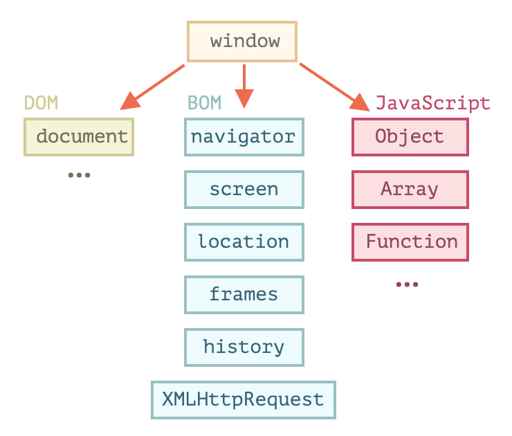

# [Document](https://javascript.info/document)

## 1.1) [Browser environment, specs](https://javascript.info/browser-environment)

자바스크립트는 본래 웹 브라우저에서 사용하려고 만든 언어이지만, 지금은 다양한 플랫폼 (호스트) 을 지원하는 언어로 변모함.

호스트 환경마다 해당 플랫폼에 특정되는 기능을 제공한다. Ex. 웹브라우저 - 웹 페이지를 제어하기 위한 수단, Node.js - 서버 사이드 기능

### 호스트 환경이 웹 브라우저일 때 사용할 수 있는 기능

출처: https://ko.javascript.info/browser-environment



#### window

최상단에 위치한 루트 객체이다. 아래의 역할을 한다.

1. JS 코드의 전역 객체 - 스크립트의 전역 함수는 곧 전역 객체 window의 메서드
```js
function sayHi() {
  alert("안녕하세요.");
}

// 전역 함수 = window 의 메서드
window.sayHi();
```
2. 브라우저 창을 대변하고, 이를 제어할 수 있는 메서드를 제공

```js
alert(window.innerHeight); // 창 내부(inner window) 높이
```

#### DOM (문서 객체 모델, Document Object Model)

DOM은 웹 페이지 내의 모든 콘텐츠를 객체로 나타내주며, 이 객체는 수정 가능함.

`document` 객체는 페이지의 기본 진입점 역할을 하고, `document` 객체를 이용해 페이지 내 무엇이든 변경할 수 있고 원하는 것을 만들 수도 있음.

```js
// 배경색 변경
document.body.style.background = "purple";

// 1초 후 원상태로 복구
setTimeout(() => document.body.style.background = "", 1000);
```

DOM은 수많은 기능을 제공하는데, 관련 프로퍼티와 메서드에 대한 정보는 관련 명세서에서 찾을 수 있음. (WHATWG의 DOM Living Standard – [https://dom.spec.whatwg.org](https://dom.spec.whatwg.org/))

#### BOM (브라우저 객체 모델, Browser Object Model)

BOM은 문서 이외의 모든 것을 제어하기 위해 브라우저가 제공하는 추가 객체.

[예시]

- navigator 객체 - 브라우저와 운영체제에 대한 정보를 제공함. ex) 현재 사용 중인 브라우저 정보를 알려주는 `navigator.userAgent`, 브라우저가 실행 중인 운영체제 정보를 알려주는 `navigator.platform`
- location 객체 - 현재 URL을 읽게 해주고, 새로운 URL로 변경(redirect) 할 수 있게 해줌

그 외에 alert, confirm, prompt 역시 BOM의 일부이다. 문서와 직접 연결되어 있진 않지만, 사용자와 브라우저 사이의 커뮤니케이션을 도와주는 브라우저 메서드이다.


## 1.2) [DOM tree](https://javascript.info/dom-nodes)

DOM에 따르면 **모든 HTML 태그는 객체**이다. 태그 내의 문자 역시 객체이다.
이런 모든 객체는 자바스크립트를 통해 접근할 수 있고, 페이지를 조작할 때 이 객체를 사용한다.

위에서 본 예시를 다시 보면

```js
document.body.style.background = "purple";
```

`document.body` 는 `<body>` 태그를 객체로 나타낸 것이다.

다른 예시들로는 `innerHTML` : 해당 노드의 HTML 컨텐츠 / `offsetWidth` – 해당 노드의 너비(픽셀) 등이 있다.

### DOM 구조

DOM은 HTML을 **태그 트리 구조**로 표현한다. 트리에 있는 노드는 모두 객체이다.

- `<html>` 은 루트 노드가 되고,  `<head>`와 `<body>`는 루트 노드의 자식이 됨
- 요소 내의 문자는 텍스트 노드가 됨. 텍스트 노드는 문자열만 담으며, 자식노드를 가질 수 없음 ( = 트리의 끝에서 leaf node가 됨)
- 새 줄 (줄바꿈), 들여쓰기를 위한 공백 역시 유효한 문자로써, 텍스트 노드가 됨. 하지만 이런 공간은 대개 HTML이 브라우저에서 표현되는 것에 영향을 미치지 않기 때문에 개발자 도구에서 보이지 않음
- HTML 안의 모든 것은 (심지어 주석이더라도) DOM을 구성한다.

DOM을 구성하는 노드 타입은 총 [열두 가지](https://dom.spec.whatwg.org/#node) 인데, 실무에선 주로 4가지 노드를 다룬다.

1. DOM의 진입점이 되는 `document` 노드
2. HTML 태그에서 만들어지면 DOM 트리를 구성하는 블록인 `element` 노드
3. 텍스트를 포함하는 `text` 노드
4. 주석이라 화면에 보이지는 않지만, JS를 사용해 정보를 DOM으로부터 읽을 수 있는 `comment` 노드

### 요약

HTML/XML 문서는 브라우저 안에서 DOM 트리로 표현된다.

- 태그는 요소 노드가 되고 트리 구조를 형성한다.
- 문자는 텍스트 노드가 된다.
- 이 외에 HTML 내의 모든 것 (주석 또한) 은 DOM을 구성한다.

개발자 도구를 사용하면 DOM을 검사하고, 바로 수정해 볼 수 있다.


## 1.3) [Walking the DOM](https://javascript.info/dom-navigation)


## 1.4) [Searching: getElement*, querySelector*](https://javascript.info/searching-elements-dom)


## 1.5) [Node properties: type, tag and contents](https://javascript.info/basic-dom-node-properties)


## 1.6) [Attributes and properties](https://javascript.info/dom-attributes-and-properties)


## 1.7) [Modifying the document](https://javascript.info/modifying-document)


## 1.8) [Styles and classes](https://javascript.info/styles-and-classes)


## 1.9) [Element size and scrolling](https://javascript.info/size-and-scroll)


## 1.10) [Window sizes and scrolling](https://javascript.info/size-and-scroll-window)


## 1.11) [Coordinates](https://javascript.info/coordinates)